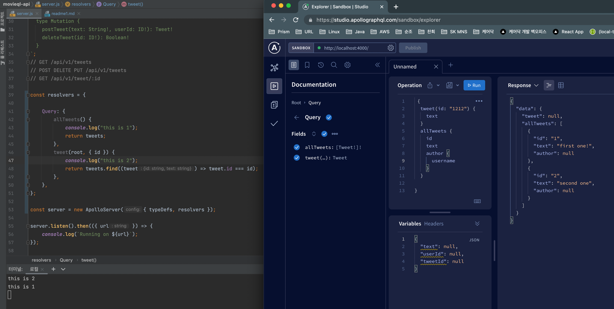

#  GraphQL로 영화 API 만들기

node : v16.13.1
npm : 8.1.2
react : 5.0.1 ( create-react-app --version )

# 1 [2022 UPDATE] INTRODUCTION

# 1.1 ❤️ 무료 강의 ❤️

# 1.0 Welcome (01:20)

# 1.1 Requirements (02:17)

# 1.2 Software Requirements (02:05)

# 2 [2022 UPDATE] BEFORE GRAPHQL

# 2.0 What is an API? (07:14)

api : application programming interface

# 2.1 What is REST? (09:34)

rest api : 서로 다른 서버간의 통신이나 ios 어플리케이션이 서버와 통신할 때 사용하는데 url로 이루어 졌다

# 2.2 REST + HTTP (08:24)

# 2.3 Recap (05:47)
# 3 [2022 UPDATE] WELCOME TO GRAPHQL

# 3.0 What is GraphQL? (03:56)

# 3.1 Overfetching (04:23)

rest api의 단점 2가지를 보완
1. rest api 는 over-fetching ( 필요없는 컬럼의 Data도 받아야 한다.) 그러나 graphql은 필요한 Data를 요청한다

# 3.2 Underfetching (05:58)

2. under fetching : 내가 원하는 것 보다 적게 fetch 하여 2번 이상 요청을 해야하는 경우

# 3.3 Try GraphQL (09:45)

* graphql 테스트

  https://graphql.org/swapi-graphql/?

# 4 [2022 UPDATE] YOUR GRAPHQL API

# 4.0 Setup (05:21)

* applo server 설치
  * npm init -y
  * npm i apollo-server graphql
  * npm i nodemon -D
  * touch server.js
  * touch .gitignore 

# 4.1 Query Type (08:50)

실행
npm run dev

# 4.2 Scalar and Root Types (10:06)

# 4.3 Mutation Type (09:22)

# 4.4 Non Nullable Fields (07:25)

! 느낌표를 주면 필수로 입력하거나 필수로 리턴해 준다는 의미

# 4.5 Recap (07:02)

* type Query - GET Request

  graphql 서버에서 type Query는 가장 기본 type이고 required type이다

  user가 request 할 수 있는 것들이 된다.

* Mutation - POST DELETE PUT PATCH Request

  API와 소통할 수 있게 해 준다.

  DATABASE에 영향을 준다.

* ! (느낌표) : 사용하지 않는다면 nullable field 사용하면 not null field
 
# 4.6 Query Resolvers (11:36)

# 4.7 Mutation Resolvers (09:11)

# 4.8 Type Resolvers (08:51)

# 4.9 Relationships (07:23)

# 4.10 Documentation (04:51)

# 4.11 Migrating from REST to GraphQL (09:58)

# 4.12 GraphQL and Beyond (03:18)